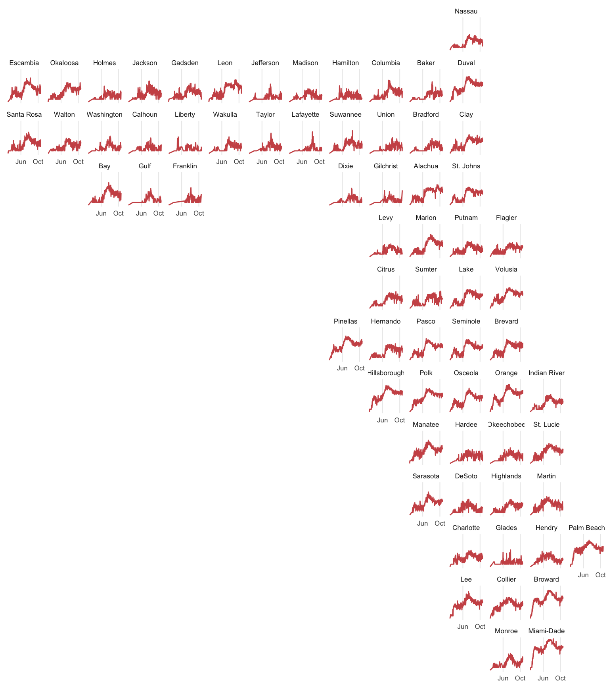

<!-- README.md is generated from README.Rmd. Please edit that file -->

# Florida COVID-19 Cases By Day and County

## Packages

``` r
library(tidyverse)

# install.packages("geofacet")
library(geofacet)
```

## Data

The data is downloaded from a
[gadenbuie/covid19-florida](https://github.com/gadenbuie/covid19-florida),
a data repository collecting snapshots of data released by Florida
Department of Health. The source data is available frok the FDOH [ArcGIS
Feature
Server](https://services1.arcgis.com/CY1LXxl9zlJeBuRZ/ArcGIS/rest/services/Florida_COVID_19_Cases_by_Day_For_Time_Series/FeatureServer).

``` r
fl_cases_by_day <- read_csv(
  "https://github.com/gadenbuie/covid19-florida/raw/master/data/covid-19-florida_arcgis_cases-by-day.csv"
)
```

## COVID-19 Cases by County


